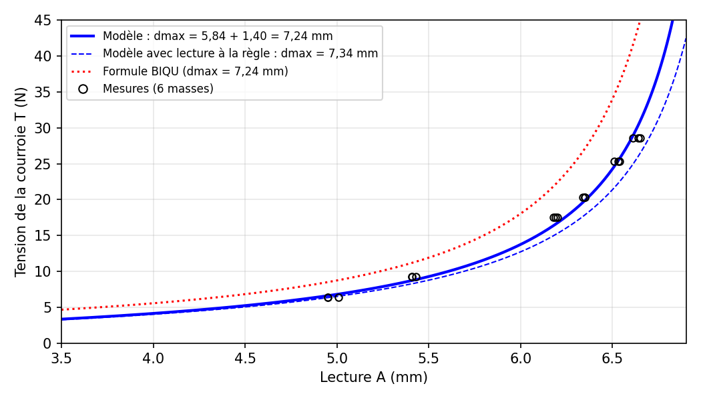

<div align="center">


# Belter BigTreeTech · tension de courroie

**Mesurer la tension d'une courroie GT2 en newtons avec un tensiomètre BigTreeTech Belter :
ressort étalonné, modèle physique validé à ±6 %, calculateur en ligne et rapports techniques complets.**

[**Site du projet**](https://USERNAME.github.io/belter-bigtreetech/) ·
[**Calculateur**](https://USERNAME.github.io/belter-bigtreetech/outil/) ·
[Rapport ressort](https://USERNAME.github.io/belter-bigtreetech/rapports/ressort.html) ·
[Rapport courroies](https://USERNAME.github.io/belter-bigtreetech/rapports/courroies.html)


-2F7A4B?style=flat-square)

</div>

---

<p align="center"></p>

Le Belter affiche un enfoncement en millimètres. Ce projet le transforme en instrument de mesure :

1. **Étalonnage du ressort** : deux campagnes de masses suspendues (120 lectures) donnent
   `F = 0,337 + 0,1226·A` (N, Belter vertical), à ±3 g près, frottement 0,3 g.
2. **Géométrie mesurée** : entraxe des appuis 59,75 mm, lecture de référence 5,84 mm sur la
   pièce de calibration BigTreeTech, épaisseur de courroie 1,40 mm.
3. **Modèle en trois points**, sans aucun paramètre ajusté :

   ```
   T = (0,406 + 0,1226·A) · 59,75 / (4 · (7,24 − A))      T en N, A en mm (GT2 9 mm, tige horizontale)
   ```

4. **Validation** sur un brin GT2 chargé par 6 masses de 648 à 2916 g : **±6 %** entre 6 et 29 N.
   La formule empirique BIQU surestime la tension de +22 à +52 % sur la même courroie.

## Le calculateur

Une page HTML autonome ([`outil/index.html`](outil/index.html)), sans dépendance, utilisable sur téléphone :

- tension en direct (N, kgf, lbf), zone de validité et sensibilité par 0,01 mm lu ;
- conseil de réglage : sens et nombre de tours du tendeur pour viser 87 Hz (CoreXY) ou 84 Hz (hybride) ;
- Rat Rig V-Core 4.1 mono-tête ou IDEX, tailles 300 à 500, courroies upper, lower et Y hybrides ;
- comparaison de deux courroies et étalonnage de l'effet d'un quart de tour sur ta machine ;
- autres courroies (GT2 6, 10, 12 mm) ou paramètres libres.

## Documentation

| Document | Contenu |
|---|---|
| [Rapport 1 · Caractérisation du ressort](rapports/ressort.html) ([.docx](fichiers/Rapport_Ressort_Belter_bigtreetch.docx)) | Bilan des forces, 2 campagnes d'étalonnage, régressions et incertitudes, modèle théorique du ressort, contrainte dans le fil, application à la tension et validation par masses. |
| [Rapport 2 · Belter et macro de résonance](rapports/courroies.html) ([.docx](fichiers/Rapport_Mesure_Courroies_Belter_Macro.docx)) | Comparaison avec la macro `MEASURE_COREXY_BELT_TENSION` de RatOS sur V-Core 4.1, en mono-tête et en IDEX ; procédures de réglage. |
| [Mesures brutes](fichiers/Mesures_Belter.xlsx) | Classeur des relevés d'étalonnage et du ressort. |

## Structure du dépôt

```
├── index.html          page d'accueil (GitHub Pages)
├── outil/              calculateur de tension
├── rapports/           rapports techniques en HTML
├── figures/            figures des rapports
├── fichiers/           rapports .docx et mesures .xlsx originaux
└── assets/             style, script de thème, icône
```

Le site est statique : il suffit d'ouvrir `index.html` dans un navigateur, ou de le servir avec
`python3 -m http.server`.

## Limites

Modèle validé pour une courroie GT2 9 mm de 1,40 mm d'épaisseur, embout imprimé en place et tige horizontale.
Pour une autre courroie : mesurer son épaisseur et refaire au moins deux points avec des masses.

## Licence

- Code (calculateur, pages, scripts) : [MIT](LICENSE).
- Rapports, mesures et figures : [CC BY 4.0](LICENSE-docs.md), sauf les figures 1 et 2 du rapport courroies (© Rat Rig).

Projet indépendant, non affilié à BigTreeTech/BIQU ni à Rat Rig.
