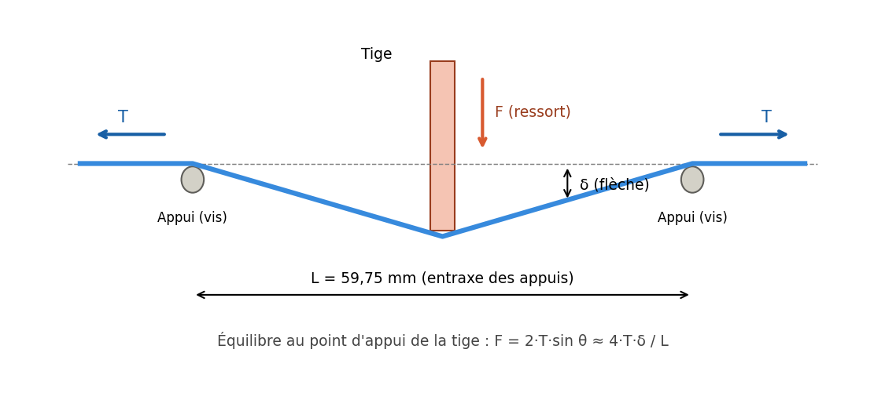
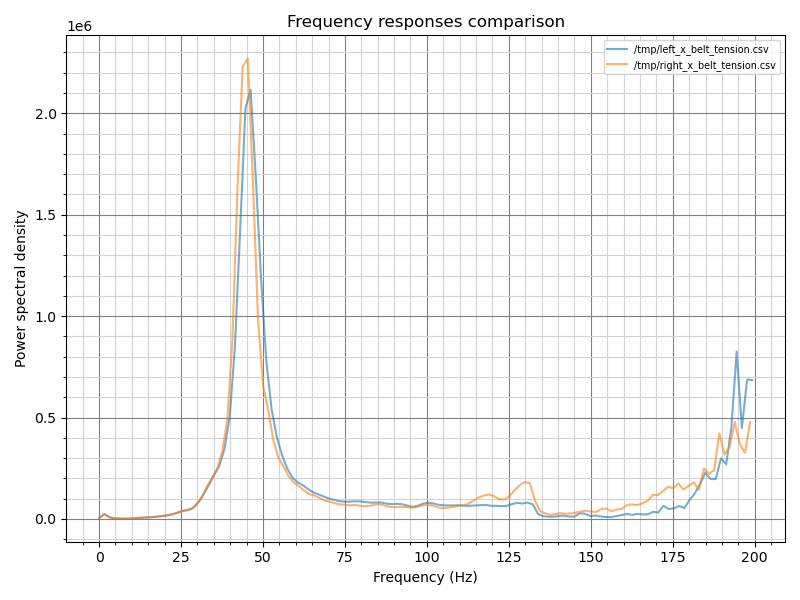

# Belter BigTreeTech · tension de courroie

**Mesurer la tension d'une courroie GT2 en newtons avec un tensiomètre BigTreeTech Belter :
ressort étalonné, modèle physique validé à ±6 %, calculateur et rapports techniques.**


-2F7A4B?style=flat-square)

<p align="center"></p>

Le Belter affiche un enfoncement en millimètres. Ce projet le transforme en instrument de mesure,
avec un modèle construit uniquement à partir de grandeurs mesurées, puis vérifié par masses suspendues.

| | |
|---|---|
| **±6 %** | précision validée entre 6 et 29 N |
| **120** | lectures d'étalonnage du ressort, en montée et en descente |
| **6** | masses de contrôle, de 648 à 2916 g |
| **+22 à +52 %** | erreur de la formule constructeur (BIQU) sur la même courroie |

## Le modèle

<p align="center"></p>

Deux appuis sur le dos de la courroie, la tige au milieu du brin : la tension équilibre la force de la tige.

```
T = F · L / (4 · δ)

F = 0,406 + 0,1226 · A      force de la tige (N), étalonnée, tige horizontale
δ = 5,84 + e − A            flèche de la courroie (mm), e = épaisseur de la courroie
L = 59,75 mm                entraxe des appuis

GT2 9 mm (e = 1,40 mm) :  T = (0,406 + 0,1226·A) · 59,75 / (4 · (7,24 − A))
```

1. **Étalonnage du ressort** : deux campagnes de masses suspendues, `k = 0,1235 N/mm` à ±1,1 %,
   précharge 42 g, frottement 0,3 g.
2. **Géométrie mesurée** : entraxe des vis 59,75 mm, lecture de référence 5,84 mm sur la pièce de
   calibration BigTreeTech, épaisseur de courroie 1,40 mm.
3. **Validation** sur un brin GT2 de 48 cm chargé par des masses connues :

| Masse | T réelle | Lecture A | Modèle | Formule BIQU |
|---:|---:|---:|---:|---:|
| 648 g | 6,36 N | 4,97 mm | +5 % | +35 % |
| 939 g | 9,21 N | 5,42 mm | −5 % | +22 % |
| 1790 g | 17,56 N | 6,19 mm | −6 % | +26 % |
| 2071 g | 20,32 N | 6,35 mm | −3 % | +33 % |
| 2585 g | 25,36 N | 6,53 mm | 0 % | +40 % |
| 2916 g | 28,61 N | 6,63 mm | +5 % | +52 % |

## Le calculateur

[`outil/belter_tension.html`](outil/belter_tension.html) est une page HTML autonome : télécharge-la et
ouvre-la dans un navigateur, sur ordinateur ou sur téléphone. Aucune installation.

- tension en direct (N, kgf, lbf), zone de validité et sensibilité par 0,01 mm lu ;
- conseil de réglage : sens et nombre de tours du tendeur pour viser 87 Hz (CoreXY) ou 84 Hz (hybride) ;
- Rat Rig V-Core 4.1 mono-tête ou IDEX, tailles 300 à 500, courroies upper, lower et Y hybrides ;
- comparaison de deux courroies, étalonnage de l'effet d'un quart de tour sur la machine ;
- autres courroies (GT2 6, 10, 12 mm) ou paramètres libres.

## Belter ou macro de résonance ?

Le second rapport compare le Belter à la macro `MEASURE_COREXY_BELT_TENSION` de RatOS sur Rat Rig V-Core 4.1,
en mono-tête et en IDEX.

| | Belter | Macro de résonance |
|---|---|---|
| Question | Chaque courroie est-elle à la bonne tension ? | La machine se comporte-t-elle de façon symétrique ? |
| Résultat | Absolu, en newtons | Relatif, compare deux côtés |
| Durée | Quelques secondes par brin | Plusieurs minutes par test |
| Voit | La tension seule | Tension, équerrage, jeu, frottements |

<p align="center"></p>

## Documentation

| Fichier | Contenu |
|---|---|
| [`docs/Rapport_Ressort_Belter_bigtreetch.docx`](docs/Rapport_Ressort_Belter_bigtreetch.docx) | Caractérisation du ressort : bilan des forces, 2 campagnes d'étalonnage, régressions et incertitudes, modèle théorique, contrainte dans le fil, application à la tension et validation. |
| [`docs/Rapport_Mesure_Courroies_Belter_Macro.docx`](docs/Rapport_Mesure_Courroies_Belter_Macro.docx) | Belter et macro de résonance sur V-Core 4.1, mono-tête et IDEX ; procédures de réglage. |
| [`mesures/Mesures_Belter.xlsx`](mesures/Mesures_Belter.xlsx) | Relevés bruts : étalonnage et ressort. |
| [`docs/figures/`](docs/figures) | Figures des deux rapports, en PNG. |

## Structure

```
├── outil/      calculateur de tension (HTML autonome)
├── docs/       rapports techniques (.docx) et leurs figures
├── mesures/    relevés de mesure (.xlsx)
├── LICENSE          licence MIT (code)
└── LICENSE-docs.md  licence CC BY 4.0 (documentation)
```

## Limites et suite

Modèle validé pour une courroie GT2 9 mm de 1,40 mm d'épaisseur, embout imprimé en place, tige horizontale.

- [ ] Refaire une série de 6 masses un autre jour (reproductibilité)
- [ ] Mesurer les longueurs de brin des V-Core 4.1 IDEX en position de réglage Rat Rig
- [ ] Vérifier la masse linéique (0,0126 kg/m) en pesant au moins 1 m de courroie
- [ ] Valider d'autres courroies (épaisseur + au moins deux points avec masses)
- [ ] Clore la question de la précharge du ressort (force de décollage à la balance)

## Licence

Code : [MIT](LICENSE). Rapports, mesures et figures : [CC BY 4.0](LICENSE-docs.md), sauf
`docs/figures/courroies/fig01.png` et `fig02.png` (© Rat Rig).
Projet indépendant, non affilié à BigTreeTech/BIQU ni à Rat Rig.
